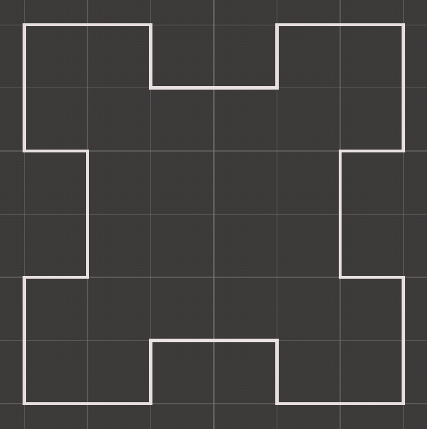
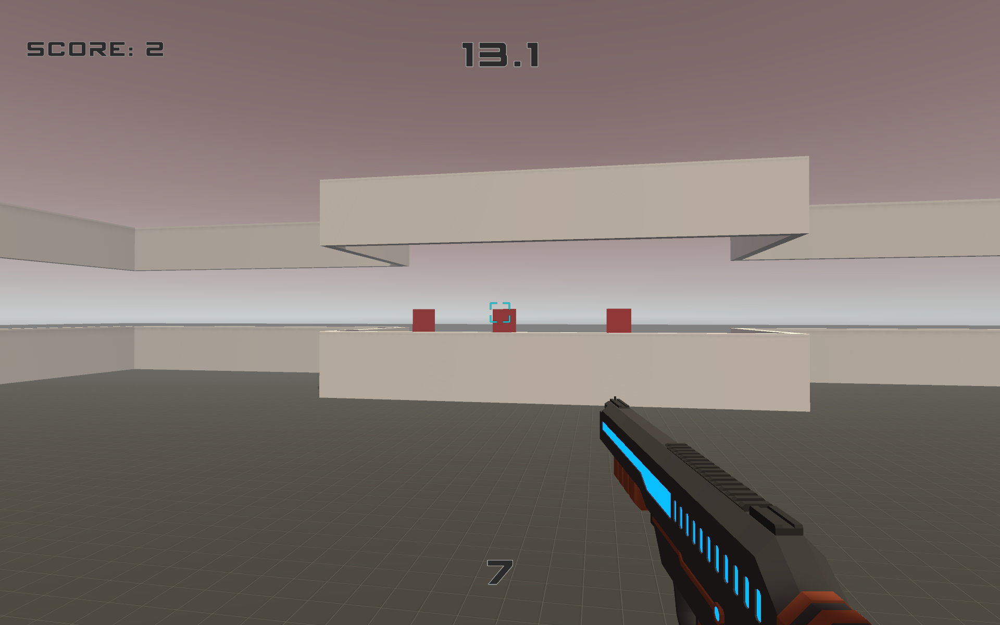
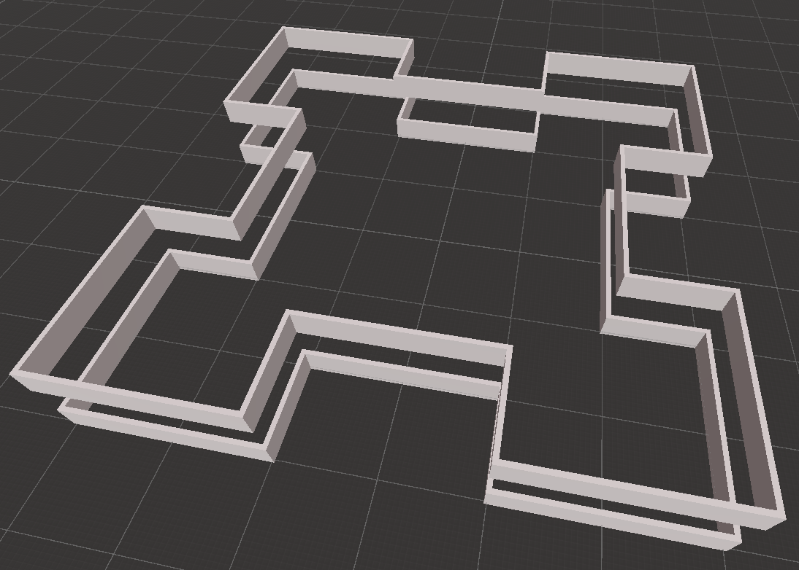
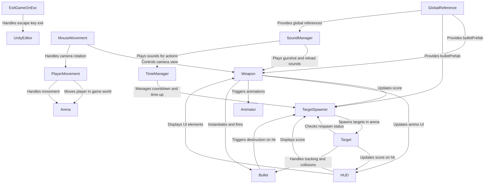
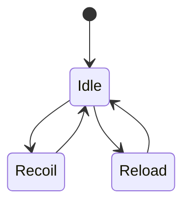

<h1 align="center">
  
    
  AimWave
    
</h1>

  <a href="#gameplay">Gameplay</a> •
  <a href="#controls">Controls</a> •
  <a href="#user-interface">User Interface</a> •
  <a href="#world">World</a> •
  <a href="#project-structure">Project Structure</a> •
  <a href="#external-assets">External Assets</a>

AimWave is a simple 3D first-person shooter developed in Unity. In this game, players shoot targets to score points within a 30-second time limit, aiming to achieve the highest possible score before time runs out.

## Gameplay

The game features a simple scoring system, granting 1 point for each target hit. Targets randomly appear along the walls facing the player, and must be shot to score. Each wall has 3 targets, and to make them reappear, all 3 must be destroyed. The next set of targets will spawn after a brief delay. The game ends when the 30-second timer runs out. Players can reload their gun at any moment, though the weapon can only hold 10 bullets at a time.

 

  
    
  <em>Gameplay Highlight.</em>

 

## Controls

To control the game, the player can use the mouse to aim the gun and move the character using the `W`, `A`, `S`, and `D` keys. Shooting is triggered by pressing the `Left Mouse Button`. Reloading the gun is done by pressing the `R` key. The game begins with a press of the `Space` key. Pressing `Esc` quits the game immediately.

The following table lists the controls in the game:

| Action       | Key                |
|--------------|--------------------|
| Aim          | Move Mouse         |
| Move         | W, A, S, D         |
| Shoot        | Left Mouse Button  |
| Reload       | R                  |
| Start Game   | Space              |
| Exit Game    | Esc                |

## User Interface

The HUD provides essential information to the player, allowing them to track their progress and manage their resources.
It displays the score, time left and the ammo count. The crosshair is used to aim the gun.

 

  
    
  <em>Head-Up Display (HUD).</em>

 

## World

The arena map is designed as a simple, enclosed space with walls that serve as the spawning points for targets. The layout is straightforward to ensure that players can focus on shooting targets without unnecessary distractions.

 

  
    
  <em>Arena Layout.</em>

 

## Project Structure

The project is structured around several scripts that manage different aspects of the game, such as player movement, shooting, target spawning, and audio management. The game features a variety of scripts, prefabs, and assets that work together to create a cohesive gameplay experience.

### Scene

The game consists of a single scene that contains all the elements required for gameplay. The scene is organized into different game objects that represent various components of the game, such as the player, targets, arena, and user interface elements.

- Ground: The base of the arena where the player moves and interacts.
- Arena: A defined space that includes walls and box colliders acting as sensors to detect the presence of targets.
- Directional Light: Provides ambient lighting for the scene.
- Skybox: A procedural skybox material used for environmental effects.
- GlobalReference: A singleton script that manages global references such as the bullet prefab, ensuring a central point of access for resources across the code.
- SoundManager: Centralized control for playing sound effects, handling the audio of actions such as shooting, reloading, and time events.
- TargetManager: Responsible for spawning, managing, and destroying targets within the arena.
- TimeManager: Handles the countdown timer for the game, controlling time-based events such as the start and end of a round.
- HUD: User Interface elements that display the crosshair, score, remaining time, and current ammo.
- MainCamera: The camera that follows the player’s viewpoint, used to simulate first-person view.
- Body: Represents the player character, controlled by the player’s input.
- GroundCheck: A collider used to check if the player is grounded, influencing movement and gravity.
- Rifle: The player's weapon, attached to the character.
    - BulletSpawn: The point from which bullets are instantiated when fired.
    - MuzzleFlashEffect: Particle system that displays the muzzle flash animation when the rifle fires.

  <em>Game Script Interactions Diagram.</em>

 

### Scripts

Scripts are used to control various aspects of the game, including player movement, shooting, target spawning, and audio management.

#### Weapon Management

The `Weapon` script handles firing, reloading, ammo management, and the visual effects associated with shooting. It controls the fire rate, ammo count, and reload time.

#### Target Spawning and Management

The `TargetSpawner` manages the spawning of targets at random positions along the arena's walls. It checks if there are any targets on the walls before respawning them.

Box collider sensors on the walls detect if a target is present, allowing for intelligent respawning when a wall is clear of targets.

Targets are destroyed when hit by bullets, and the score is updated accordingly.

#### Game Flow and Events

The `CountdownTimer` manages the countdown before the round starts and the timer during the round, handling the start, end, and time-up events.

The `TargetSpawner` increments the score whenever a target is destroyed, and the score is displayed on the HUD.

#### Audio Management

The `SoundManager` handles different sounds such as gunshots, reloads, countdowns, and time-ups. The script uses `AudioSource` components for each sound effect, ensuring all audio elements are controlled centrally.

#### Player Input

`MouseMovement` anages player mouse input for aiming the camera and rotating the player's view.

`PlayerMovement` handles the player's movement across the arena with respect to gravity and ground detection. The `CharacterController` is used for smooth movement.

#### Scene Management

The `GlobalReference` singleton ensures that global objects, like the bullet prefab, are accessible across all scenes without creating unnecessary duplicates.

#### Physics and Collisions

Bullets are instantiated and moved using physics (RigidBody). They are destroyed after a set lifetime or upon collision with a target. The `Bullet` script ensures that collisions with targets trigger appropriate actions such as scoring and target destruction.

`PlayerMovement` script uses a ground check and gravity system to simulate realistic movement and falling physics for the player.

### Animations

Rifle animatios are used to control the rifle's behavior during different actions.

- Idle: When the rifle is at rest.
- Recoil: Triggered when the player fires the weapon, simulating gun recoil.
- Reload: Animates the reloading process when ammo is being reloaded.

  <em>Rifle Animation State Diagram.</em>

 

### Prefabs

The `Bullet` prefab is instantiated when the player shoots, handling bullet behavior like movement, collisions, and destruction.

The `Target` prefab represents the objects the player must shoot to score points. Targets are spawned and managed by the `TargetSpawner` script.

### Audio Assets

Gunshot, reload, countdown, and time-up sounds are used to enhance the game experience. These sounds are managed by the `SoundManager` script and played at appropriate times during gameplay.

### External Assets

The game uses several external assets to enhance the visual and audio experience.

- [Low Poly Sci-Fi Weapons Lite](https://assetstore.unity.com/packages/3d/props/guns/low-poly-sci-fi-weapons-lite-296460): The rifle model used in the game, providing a futuristic aesthetic to the weapon.
- [Particle Pack](https://assetstore.unity.com/packages/vfx/particles/legacy-particle-pack-73777): Particle effects like muzzle flashes are used to enhance the visual feedback when the player shoots.
- [Prototyping Pack](https://assetstore.unity.com/packages/3d/prototyping-pack-free-94277): The ground is built using an asset from this pack.
- [Crosshair](https://kenney.nl/assets/crosshair-pack): A visual crosshair asset used to indicate the player's aim on the screen.
- [HUD Font](https://www.dafont.com/spy-agency.font): The font used for the HUD elements, providing a futuristic and sleek look to the text.
- [Sound Effects](https://pixabay.com/sound-effects/search/public-domain/): Sounds are used to enhance the immersive experience of the game.
